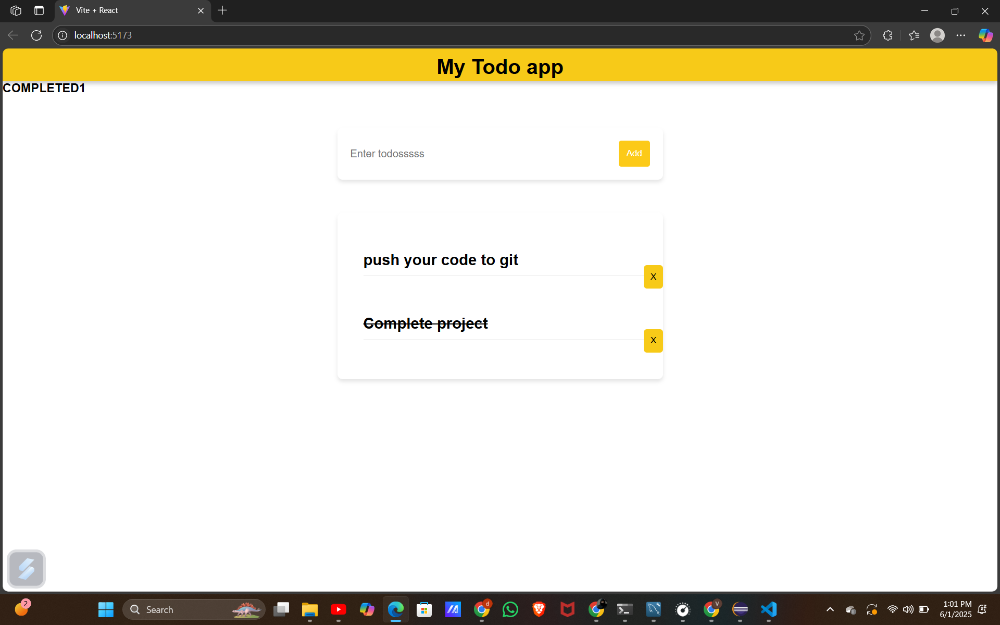

# ✅ Todo App

A **modular and responsive React application** that lets users manage their daily tasks. This project allows adding, displaying, and deleting todos in a clean interface. It is built using **Vite** for fast development, and **CSS Modules** for scoped styling. Ideal for beginners to learn state management and component composition in React.

---

## 🖼️ App Preview



## 💡 Features

- ➕ **Add Todos**  
  Users can input tasks using a dedicated form component.
  
- 📋 **Display Todo List**  
  Renders a list of tasks dynamically as the user adds them.

- ❌ **Delete Tasks**  
  Each task has a delete icon to remove it from the list.

- ⚛️ **Stateful Components**  
  Utilizes React Hooks (`useState`) for managing and updating UI state.

- 🎨 **Scoped Styling**  
  Uses CSS Modules (`*.module.css`) for each component to avoid global conflicts.

- 🧩 **Reusable Components**  
  Components like `Form`, `TodoItem`, `TodoList`, and `Header` are separated for maintainability.

- ⚡ **Fast Development Setup**  
  Vite ensures a fast refresh and optimized dev experience.

---

## 📚 Learning Outcomes

By building and analyzing this project, you will:

- Understand how to create and structure a **React project** with Vite
- Practice **functional components** and use of **React Hooks (useState)**
- Learn how to **lift and manage state** across components
- Get hands-on with **props drilling** for component communication
- Learn how to use **CSS Modules** for localized, conflict-free styling
- Understand how to organize code for **separation of concerns**
- Gain insight into event handling and dynamic rendering in React

---

## 🛠️ Technologies Used

- **React** (via Vite)
- **JavaScript (ES6+)**
- **CSS Modules**
- **Vite** (for fast dev server and builds)

---

## 📂 Project Structure

```
todoapp/
├── src/
│ ├── components/
│ │ ├── Form.jsx
│ │ ├── form.module.css
│ │ ├── Header.jsx
│ │ ├── header.module.css
│ │ ├── Todo.jsx
│ │ ├── Todoitem.jsx
│ │ ├── todoitem.module.css
│ │ └── Todolist.jsx
│ │ └── todolist.module.css
│ ├── App.jsx
│ ├── app.module.css
│ └── main.jsx
├── index.html
├── vite.config.js
├── package.json
├── .gitignore
└── README.md


---

## 📦 How to Run the Application

1. **Clone the repository**
   ```bash
   git clone https://github.com/yourusername/todoapp.git
2. **Navigate to the project folder**
    ```bash
        cd my-todo-app

3. **Install Dependencies**
    ```bash 
         npm install
4. **Start the development server:**
   ```bash
         npm run dev

---

##Future Enhancements

-📝 Edit existing todos
-💾 Store todos in local storage or connect to a backend
-📅 Add due dates and filtering


---

## 🙋‍♂️ Author

**VISHWA S**  
[GitHub](https://github.com/yourusername)

---

## 📄 License

This project is licensed under the [MIT License](LICENSE).


---

## Acknowledgments

 Thanks to the React community and open-source tutorials that inspired this project.

